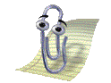
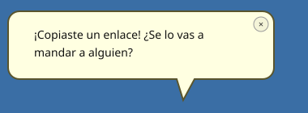

<div align="center">

# 📎 TheReturnOfClippy


**✉️ Andá directo a la sección que te interese ✉️**
[Qué es esto](#-qué-es-esto) · [Funciones](#-funciones) · [Instalación](#-instalación) · [Compilar](#-compilar-desde-el-código-fuente) · [Stack](#-hecho-con) · [Contribuir](#-contribuir) · [Créditos](#-créditos) · [Licencia](#-licencia)

</div>

---

## 📎 Qué es esto

¿Te acordás de **Clippy**, el clip de Microsoft Office que aparecía de la nada a decirte *"Parece que estás escribiendo una carta"*? Este proyecto lo trae de vuelta, pero esta vez **vive en tu escritorio de Windows de verdad** — no adentro de Word, sino flotando sobre cualquier cosa que tengas abierta, como un bicho de escritorio (*desktop pet*) old-school.

Es un `.exe` nativo, liviano, sin instalador raro ni dependencias de terceros — todo lo visual (el globo de diálogo, las ventanas estilo XP "Luna", los botones brillosos) está hecho con GDI+ desde cero, tal como se hacía antes de que existiera Bootstrap.

> 100% open source. Cloná, rompé, arreglá, mandá un PR.

---

## 👀 Mirá cómo se ve

<div align="center">

| Saludo | Onda | Atención |
|:---:|:---:|:---:|
|  |  |  |

Así reacciona cuando copiás un link (mismo diseño y colores que el globo real):



</div>

---

## ✨ Funciones

- 🪟 **Ventana transparente de verdad** — flota sobre el escritorio con transparencia real por píxel (nada de trucos de color clave), siempre encima de todo.
- 🖱️ **Arrastrable y redimensionable** — llevalo a cualquier parte de la pantalla, elegí entre 4 tamaños.
- 🎬 **41 animaciones originales** — las mismas de Office 97-2003, reproducidas cuadro por cuadro con su timing real.
- 💬 **Reacciona al portapapeles** — copiá texto o una captura de pantalla (`Win+Shift+S`) y comenta algo al respecto.
- ⏰ **Recordatorios de verdad** — desde un aviso rápido "en 10 minutos" hasta recordatorios con fecha, hora, categoría y repetición (persistidos en disco, con buscador y edición).
- 🎂 **Cumpleaños** — el tuyo, o los de otras personas vía un asistente de 3 pasos — avisa el día, o el día antes si querés.
- 🎉 **Fechas especiales** — Año Nuevo y Navidad, sin configurar nada.
- 😈 **Modo molesto clásico** *(opcional, apagado por defecto)* — interrupciones random con tips, fiel al espíritu del Clippy original.
- 🔊 **Sonido** — un "pop" sutil cuando reacciona a algo.
- 🚀 **Inicio con Windows** — real, vía el registro, sin trucos.
- 🧰 **Pantallas propias estilo XP** — recordatorios, búsqueda con grilla, opciones con pestañas, asistente de cumpleaños — todas con estilo propio, nada de controles nativos genéricos.
- 📌 **Ícono en la bandeja del sistema** — ocultalo y seguí teniéndolo a mano.

---

## 💾 Instalación

1. Descargá `Clippy.exe` de la carpeta [`ClippyApp/publish`](ClippyApp/publish) (o compilalo vos mismo, ver abajo).
2. Doble click.
3. Listo — ahí está, en la esquina de tu escritorio.

No necesitás tener .NET instalado: el ejecutable es autocontenido.

---

## 🔨 Compilar desde el código fuente

Necesitás el [.NET SDK 9](https://dotnet.microsoft.com/download) y Windows (usa APIs de Win32 — no corre en Linux/Mac).

```bash
cd ClippyApp
dotnet build                    # compilar y probar rápido
dotnet publish -c Release -r win-x64 --self-contained true -p:PublishSingleFile=true -p:IncludeNativeLibrariesForSelfExtract=true -o publish
```

El `.exe` autocontenido queda en `ClippyApp/publish/`.

---

## 🧱 Hecho con

- **C# / .NET 9 (Windows Forms)**
- **GDI+** para absolutamente todo lo visual custom (nada de librerías de UI de terceros)
- `UpdateLayeredWindow` (Win32) para la transparencia real por píxel
- Las mismas [42 animaciones GIF](ClippyApp/Animaciones) del Office Assistant original
- Cero paquetes NuGet de terceros. Cero.

---

## 🤝 Contribuir

Las contribuciones son bienvenidas — este es un proyecto para divertirse, no hay reglas estrictas:

1. Hacé un fork
2. Creá una rama (`git checkout -b mi-mejora`)
3. Commiteá tus cambios
4. Abrí un Pull Request

Si agregás algo, tratá de mantener el estilo: sin dependencias externas, todo lo visual hecho con GDI+, y la app 100% en español.

---

## 🙏 Créditos

- **Clippy / Clippit** fue creado originalmente por **Kevan Atteberry** para Microsoft Office (1997-2003). Este proyecto es una recreación no oficial hecha por fans, sin ningún vínculo con Microsoft.
- Recreación, código y diseño de esta versión: **[MrAlleda](https://twitch.tv/MrAlleda)** ([Instagram](https://instagram.com/MrAlleda))

---

## 📜 Licencia

Este proyecto es software libre bajo la licencia **[MIT](LICENSE)** — usalo, modificalo, y compartilo como quieras.

---

<div align="center">

⭐ **Si te gustó, dejale una estrella al repo** ⭐

</div>
